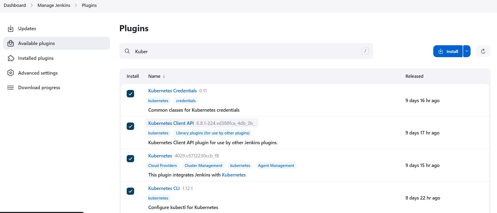
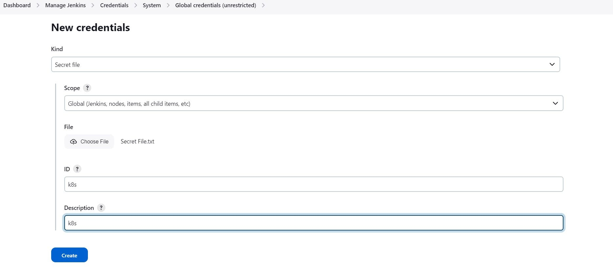

# Préambule

### Défintion des étapes du pipeline

#### Etape 1 - Maven


**Installation de plugins (installation sans redémarrage)**

👉 Eclipse Temurin Installer

👉 SonarQube Scanner

**Configuration des plugins**


**Création du job**

Créer un item dans Jenkins de type `Pipeline` que vous pouvez nommer `petstore`


Et utiliser le code ci-dessous pour définir le pipeline ;

```jenkinsfile
pipeline{
    agent any
    tools {
        jdk 'jdk17'
        maven 'maven3'
    }
    stages{
        stage ('clean Workspace'){
            steps{
                cleanWs()
            }
        }
        stage ('checkout scm') {
            steps {
                git 'https://github.com/smontri/jpetstore-6.git'
            }
        }
        stage ('maven compile') {
            steps {
                sh 'mvn clean compile'
            }
        }
        stage ('maven Test') {
            steps {
                sh 'mvn test'
            }
        }
   }
}
```

> Attention à bien utiliser le fork du repo `jpetstore-6`, que vous avez fait avant de démarrer, dans le stage `checkout scm`.

#### Etape 2 - Analyse SonarQube

**Création d'une token**

Il s'agit de créer une token pour l'utilisateur SonarQube qui sera utilisée par Jenkins pour invoquer SonarQube dans le pipeline.


Cette token doit ensuite être utilisée pour configurer les credentials Sonar dans Jenkins.


> **ID** = sonar-token
>
> **Description** = sonar-token

**Configuration du serveur Sonar**

Dans Jenkins - Manage Jenkins -> System, configurer le serveur SonarQube comme ci-dessous.


**Configuration du scanner Sonar**

Dans Jenkins - Manage Jenkins -> Tools, ajouter un scanner pour SonarQube


**Ajout d'une quality gate dans SonarQube**

Il s'agit de configurer un webhook dans SonarQube pour récupérer les informations dans la console Jenkins.

Depuis la console SonarQube :


**Name** : `Jenkins`

**URL** : `<http://IP Jenkins:8090>/sonarqube-webhook/`

**Modification de la définition du pipeline**

Nous allons ajouter 2 étapes au pipeline ainsi que des informations d'environnement pour l'utilisation du scanner SonarQube.

* Environnement du scanner, à ajouter sous la section `tools`

```
environment {
        SCANNER_HOME=tool 'sonar-scanner'
    }
```

* Ajout des étapes du pipeline, à ajouter en fin de liste des `stages`

```
stage("Sonarqube Analysis "){
            steps{
                withSonarQubeEnv('sonar-server') {
                    sh ''' $SCANNER_HOME/bin/sonar-scanner -Dsonar.projectName=Petshop \
                    -Dsonar.java.binaries=. \
                    -Dsonar.projectKey=Petshop '''
                }
            }
        }
        stage("quality gate"){
            steps {
                script {
                  waitForQualityGate abortPipeline: false, credentialsId: 'Sonar-token' 
                }
           }
        }
```

Le pipeline doit, à présent, ressembler à ceci :


Et vous pouvez consulter le résultat de l'analyse SonarQube dans la console :


#### Etape 3 - Analyse des dépendances OWASP

* Pour effectuer cette analyse, on s'appuie sur un plugin Jenkins `OWASP Dependency check`.

A installer via Manage Jenkins -> Plugins


* Pour configurer l'outil dans Jenkins, Manage Jenkins -> Tools


* Ajout de l'étape dans le pipeline, , à ajouter en fin de liste des `stages`

```
stage ('Build war file'){
            steps{
                sh 'mvn clean install -DskipTests=true'
            }
        }
        stage("OWASP Dependency Check"){
            steps{
                dependencyCheck additionalArguments: '--scan ./ --format XML ', odcInstallation: 'DP-Check'
                dependencyCheckPublisher pattern: '**/dependency-check-report.xml'
            }
        }
```

Le pipeline doit, à présent, ressembler à ceci :


Et pour visualiser le résultat de check des dépendances :


#### Etape 4 - Build de l'image Docker et push vers une registry

**Ajout des plugins Docker**

Il s'agit d'ajouter les plugins suivants :

* `Docker`
* `Docker Commons`
* `Docker Pipeline`
* `Docker API`
* `docker-build-step`


**Configuration du plugin Docker dans Jenkins**


**Ajout des credentials pour Docker Hub**

> Il s'agit de votre compte Docker Hub à renseigner


**Ajout des étapes Docker dans le pipeline**

> A ajouter en fin de liste des `stages`

```
stage ('Build and push to docker hub'){
            steps{
                script{
                    withDockerRegistry(credentialsId: 'docker', toolName: 'docker') {
                        sh "docker build -t petshop ."
                        sh "docker tag petshop <dockerhub username>/petshop:latest"
                        sh "docker push <dockerhub username>/petshop:latest"
                   }
                }
            }
        }
        stage("TRIVY"){
            steps{
                sh "trivy image smontri/petshop:latest > trivy.txt"
            }
        }
        stage ('Deploy to container'){
            steps{
                sh 'docker run -d --name pet1 -p 8080:8080 <dockerhub username>/petshop:latest'
            }
        }
```

> Remplacer la valeur par votre nom d'utilisateur Docker Hub

Le pipeline doit, à présent, ressembler à ceci :


> On peut y voir également un graphe de tendances de l'analyse des dépendances

> Et l'étape d'analyse de vulnérabilités par **Trivy**

**Image chargée dans le Docker Hub**


**Accès à l'application**

L'application est accessible via l'URL suivante : `http://<IP publique de la VM>:8080/jpetstore`


> Question : sur quel composant tourne l'application en l'état actuel

#### Etape 5 - Déploiement ver Kubernetes

A présent, nous allons déployer l'application vers un cluster Kubernetes

**Configuration Kubernetes**

* Me demander le fichier de configuration Kubernetes
* Installer les plugins suivants dans Jenkins



* Ajout des credentials Kubernetes



* Installation commande kubectl

```
sudo apt update
sudo apt install curl
curl -LO https://dl.k8s.io/release/$(curl -L -s https://dl.k8s.io/release/stable.txt)/bin/linux/amd64/kubectl
sudo install -o root -g root -m 0755 kubectl /usr/local/bin/kubectl
kubectl version --client
```

* Ajout du stage de déploiement de Kubernetes

> Créer un namespace avec le numéro du goupe (ex. groupe1) pour déployer votre application dans le namespace correspondant

```
stage('K8s'){
            steps{
                script{
                    withKubeConfig(caCertificate: '', clusterName: '', contextName: '', credentialsId: 'k8s', namespace: '', restrictKubeConfigAccess: false, serverUrl: '') {
                        sh 'kubectl create ns <votre namespace>'
                        sh 'kubectl apply -f deployment.yaml -n <votre namespace>'
                    }
                }
            }
        }
```
